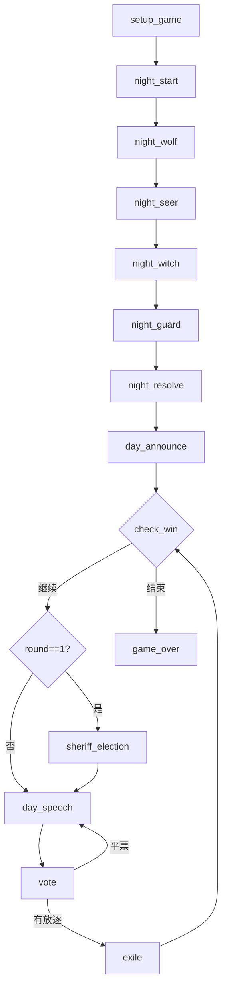

# AI 狼人杀 — 完整开发计划 (PLAN.md)

> **版本：** MVP（上帝视角）  
> **目标：** 构建一个由 LLM 驱动的 12 人局狼人杀，所有玩家均为 AI，通过终端 TUI 实现上帝视角的完整观战与调试。  
> **技术栈：** Python + LangGraph + Textual + OpenAI 兼容API 

---

## 1. 项目概述

### 1.1 核心目标
- 实现标准的 12 人局狼人杀规则（预女猎白/预女猎守板子）
- 所有玩家决策由 LLM 通过 Function Calling 产生
- 游戏流程完全自动化，无需人工干预
- 使用 Textual 构建的 TUI 提供上帝视角界面
- 为后续扩展至玩家视角预留信息隔离机制

### 1.2 非目标（MVP 阶段）
- 不实现真实的多人联网对战
- 不做语音识别/合成
- 不进行精细的前端 UI 开发
- 不处理复杂的反作弊/安全性问题

---

## 2. 技术架构

```
┌──────────────────────────┐
│      Textual TUI         │
│  (上帝视角界面 & 调试器)  │
└──────────┬───────────────┘
           │ GameEvent (EventBus)
┌──────────▼───────────────┐
│     LangGraph 状态机      │
│  (游戏流程 & 规则引擎)    │
└──────────┬───────────────┘
           │ 调用 LLM
┌──────────▼───────────────┐
│   LLM Service (DeepSeek) │
│  (Function Calling 决策) │
└──────────────────────────┘
```

- **EventBus** 是核心解耦层：LangGraph 节点发布 `GameEvent`，TUI 监听全部事件，未来玩家客户端也可选择性监听。
- **LangGraph** 负责所有阶段流转、条件分支、并发协调。
- **DeepSeek** 提供 AI 推理，通过 `tools` 定义确保输出格式稳定。

---

## 3. 游戏规则与状态机设计

### 3.1 身份配置（12人）
| 阵营 | 角色     | 数量 |
|------|----------|------|
| 狼人 | 普通狼人 | 4    |
| 好人 | 预言家   | 1    |
| 好人 | 女巫     | 1    |
| 好人 | 猎人     | 1    |
| 好人 | 白痴/守卫| 1    |
| 好人 | 普通村民 | 4    |

### 3.2 游戏阶段（LangGraph 节点）
1. **setup_game** — 随机分配角色，初始化状态。
2. **night_start** — 清理夜晚暂存数据。
3. **night_wolf** — 狼人并行提议刀人，多数票决。
4. **night_seer** — 预言家查验一名玩家。
5. **night_witch** — 女巫知晓刀口，决定救/毒。
6. **night_guard** — 守卫选择守护目标（若使用）。
7. **night_resolve** — 结算夜晚死亡（刀、毒、守护冲突）。
8. **day_announce** — 公布死讯，处理猎人/白痴被动技能。
9. **check_win** — 判断胜负（每次死亡后触发）。
10. **sheriff_election** — 首轮警长竞选（含平票循环）。
11. **day_speech** — 按顺序轮流发言。
12. **vote** — 放逐投票，含警长 1.5 票计算。
13. **exile** — 结算放逐，处理猎人开枪/白痴翻牌。
14. **game_over** — 终止状态。

### 3.3 状态图（Mermaid）


### 3.4 关键规则引擎细节
- **女巫不可自救**（首夜可救他人，多数规则）
- **同守同救死亡**（守卫守中女巫救的目标，该玩家死亡）
- **猎人被毒不能开枪**，被刀/放逐则可
- **白痴被放逐可翻牌免死**（但失去投票权），被刀则直接出局
- **警长 1.5 票**，死亡时可撕警徽或传给存活玩家
- **平票处理**：第一次平票参与平票者加时发言再投；第二次平票直接进入黑夜
- **狼人自刀**：允许，用于战术

---

## 4. 游戏状态数据结构

```python
class GameState(TypedDict):
    phase: Phase
    round: int
    alive_players: List[int]
    roles: Dict[int, Role]                 # 仅上帝可见
    sheriff_id: Optional[int]
    sheriff_can_pass: bool
    dead_history: List[Dict]               # {player_id, cause, round}

    # 夜晚暂存
    night_kill_target: Optional[int]
    witch_antidote_used: bool
    witch_poison_used: bool
    witch_antidote_target: Optional[int]
    witch_poison_target: Optional[int]
    guard_protect_target: Optional[int]
    seer_check_target: Optional[int]
    seer_check_result: Optional[str]

    # 白天投票
    nomination_speeches: List[Dict]
    vote_candidates: List[int]
    vote_records: Dict[int, int]
    exile_tie_count: int

    winner: Optional[str]
```

---

## 5. AI 决策与 LLM 集成

### 5.1 稳定输出策略
- 所有动作定义在 `tools` 列表中（Function Calling）
- 每个阶段只暴露当前可用的 1 个工具，避免误调
- 参数中强制限定 `target_id` 的合法范围（通过动态注入存活玩家列表）
- 解析层加入正则兜底 + 随机合法目标 fallback
- 单个 LLM 调用超时 8 秒，超时后随机选择合法动作

### 5.2 System Prompt 模板
不同角色在对应阶段加载不同的 System Prompt，核心结构为：
```
[角色设定] [当前轮次/状态] [历史信息] [本轮合法目标] [任务指令]
```

#### 狼人夜晚
```
你是狼人，你的队友是 {wolf_teammates}。
存活玩家：{alive_players}。
请调用 wolf_kill_proposal 函数提议刀人目标（不能是狼队友）。
```

#### 预言家夜晚
```
你是预言家。已有查验：{past_checks}。
请调用 seer_check 函数选择查验目标。
```

#### 女巫夜晚
```
你是女巫。今晚刀口：{night_kill}。
你有救药（{has_antidote}）、毒药（{has_poison}）。
请决定是否使用药水（JSON 输出）。
```

#### 白天发言（所有角色）
```
你是 {role}。你是 {player_id} 号。轮次：{round}。
公共事件：{public_summary}。
请输出 JSON：{"internal_thought":"...", "public_speech":"..."}
发言约束：
- 普通村民：表水、分析狼坑
- 预言家：必须报查验结果和警徽流
- 女巫：可隐晦提示银水
- 狼人：伪装村民，避免聊爆
```

### 5.3 并发调用与超时处理
- 狼人夜刀使用 `asyncio.gather` 并发请求所有狼人
- 每个调用设置 `asyncio.wait_for(timeout=8)`
- 超时或异常 → 随机选择合法目标
- 多数票决出最终刀口，平票则随机选

---

## 6. 事件总线与信息隔离

### 6.1 GameEvent 定义
```python
@dataclass
class GameEvent:
    scope: Literal["public", "wolf_team", "role_private", "god", "system"]
    target_players: Set[int]       # 有权查看的玩家ID
    event_type: str
    content: str                   # 人类可读文本
    data: Any = None               # 结构化数据
```

### 6.2 事件总线（EventBus）
- 全局单例，提供 `subscribe(listener)` 和 `publish(event)`
- LangGraph 节点内所有游戏事件都通过 `publish` 发出
- TUI 作为永久监听者，按 `scope` 使用不同颜色渲染
- 未来玩家客户端可根据 `scope` 和 `target_players` 过滤事件

### 6.3 信息层级与 TUI 颜色映射
| scope          | 显示颜色   | 示例                        |
|----------------|------------|-----------------------------|
| public         | 白色       | 公共发言、投票结果           |
| wolf_team      | 暗红色     | 狼队夜聊、刀人决议           |
| role_private   | 对应颜色   | 预言家查验(金)、女巫用药(紫) |
| god            | 浅灰斜体   | AI 内心独白                  |
| system         | 青色加粗   | 阶段提示                    |

---

## 7. TUI 界面设计（Textual）

### 7.1 布局
```
┌──────────────────────────────────────────┐
│                 Header                     │
├──────────┬───────────────────┬────────────┤
│ 玩家1 🟢 │                   │ 玩家7 🟢   │
│ 玩家2 💀 │    GodLog         │ 玩家8 🎤   │
│ 玩家3 🎤 │    (RichLog)      │ 玩家9 🟢   │
│ 玩家4 🟢 │                   │ 玩家10 🟢  │
│ 玩家5 🟢 │                   │ 玩家11 🟢  │
│ 玩家6 💀 │                   │ 玩家12 🟢  │
├──────────┴───────────────────┴────────────┤
│           Input (GM 指令)                  │
└──────────────────────────────────────────┘
```

- **左侧 1~6 号，右侧 7~12 号**，每个 `PlayerWidget` 显示 ID、存活/死亡图标、发言中标记
- **中间 GodLog**：监听 EventBus 显示所有事件
- **底部 Input**：可输入 `kill <id>` / `next` 等调试命令

### 7.2 实现要点
- 基于 `Textual` 的 `App`、`ComposeResult`
- CSS Grid 布局控制比例
- `PlayerWidget` 使用 `reactive` 属性绑定状态变化
- 通过 `asyncio` 事件循环与 LangGraph 图执行共存

---

## 8. 开发路线图

### Phase 1：骨架搭建（第 1-2 天）
- [x] 项目目录初始化，依赖安装
- [ ] 定义 `GameState`、`Role`、`Phase` 等核心数据结构
- [ ] 实现 `EventBus` 和 `GameEvent`
- [ ] 搭建 LangGraph 状态机框架（节点和边，先用随机动作代替 AI）
- [ ] 编写随机决策逻辑，跑通纯逻辑的“哑巴”对局

### Phase 2：AI 接入（第 3-4 天）
- [ ] 编写各角色 System Prompt 模板
- [ ] 定义所有 Function Calling 的 `tools` 定义
- [ ] 实现 LLM 调用封装（含超时、重试、fallback）
- [ ] 逐步替换节点中的随机动作为 LLM 调用
- [ ] 实现狼人夜刀并发、预言家查验、女巫用药

### Phase 3：完整流程（第 5-6 天）
- [ ] 实现白天发言与投票节点
- [ ] 加入警长竞选完整流程（发言、投票、平票）
- [ ] 实现放逐平票加时逻辑
- [ ] 完善猎人、白痴/守卫的边缘规则
- [ ] 全局联调，手动触发全流程

### Phase 4：TUI 开发（第 7-8 天）
- [ ] 使用 Textual 构建布局和 PlayerWidget
- [ ] 集成 EventBus，实现颜色区分的上帝日志
- [ ] 添加底部 GM 指令输入
- [ ] 确保 TUI 与 LangGraph 图在同一个事件循环中运行

### Phase 5：测试与优化（第 9-10 天）
- [ ] 批量运行 50-100 局无 UI 自动化对局
- [ ] 收集日志，统计胜率、异常次数
- [ ] 分析 LLM 常见逻辑错误，调整 Prompt
- [ ] 编写简单复盘脚本，标注“狼人聊爆”“预言家不报查验”等
- [ ] 修复明显的规则漏洞或崩溃

---

## 9. 未来扩展方向

- **人类玩家参与**：在 LangGraph 中引入 `interrupt`，等待 WebSocket 消息
- **Web 前端**：用 React + WebSocket 构建完整 UI
- **更复杂的板子**：支持更多角色（梦魇、狼美人、乌鸦等）
- **策略进化**：通过自我对弈生成高质量策略，注入 Prompt
- **语音模组**：TTS 和 ASR 接入，实现语音局

---

## 10. 风险与应对

| 风险                            | 应对措施                           |
|---------------------------------|------------------------------------|
| LLM 输出格式不稳定              | Function Calling 强制 JSON，多级 fallback |
| 狼人 AI 容易聊爆                | Prompt 中强调角色约束，加入反聊爆 few-shot |
| 对局时间过长（发言拖沓）         | 限制发言字数，超时随机发言         |
| LLM 成本过高                    | 使用更便宜的模型或缓存常见决策      |
| 游戏流程死锁                    | 每个节点设置全局超时，自动进入下阶段 |

---

**本计划文档会随开发进展持续更新。**