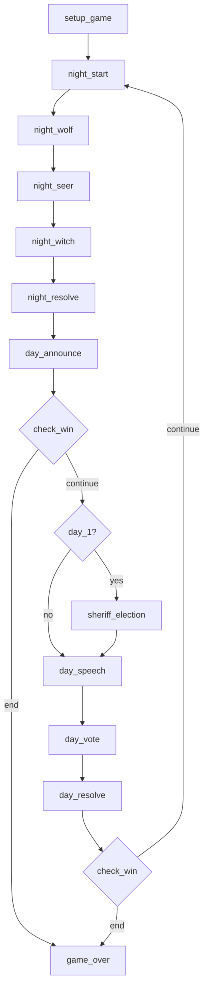

# AI 狼人杀 — 开发计划

> **版本：** MVP（上帝视角）  
> **目标：** 构建一个由 LLM 驱动的 12 人局狼人杀模拟器，所有玩家均为 AI，通过终端 TUI 实现完整观战、调试与日志回放。  
> **技术栈：** Python + LangGraph + Textual + OpenAI 兼容 API

---

## 1. 项目范围

### 1.1 MVP 目标
- 支持固定 12 人局 `预女猎白` 板子
- 所有玩家动作由 LLM 产生，规则裁定由程序完成
- 游戏流程可自动跑完，无需人工介入
- 提供上帝视角 TUI，能实时查看状态、事件与私有信息
- 为后续扩展到玩家视角保留严格的信息隔离边界
- 核心架构按“配置驱动玩法 + 配置驱动 Prompt”设计，避免后续支持其它人数和板子时重构主流程
- 每次开启游戏时自动导出当前运行时 graph 的可视化文件，便于调试、回放和核对配置是否生效

### 1.2 MVP 非目标
- 不支持真人参与
- 不支持联网、多房间和持久化对战
- 不实现语音输入输出
- 不支持多个板子混跑
- 不做复杂反作弊和权限系统

### 1.3 板子约束
- MVP 只实现 `4 狼 + 预言家 + 女巫 + 猎人 + 白痴 + 4 村民`
- `守卫` 不进入首版实现，后续作为扩展板子增加
- 首版不追求“高水平发言博弈”，优先保证流程完整、信息隔离正确、日志可调试

### 1.4 配置驱动原则
- 首版只落地一个默认板子，但代码结构必须支持后续增加其它人数和玩法配置
- “人数、角色分布、流程节点、规则开关、胜负条件、Prompt 模板”都应由配置定义，而不是散落在代码中的常量和分支
- 新增一个板子的目标成本应控制在“新增配置 + 少量角色/规则处理器 + Prompt 模板调整”，而不是重写状态机

---

## 2. 架构设计

```
┌────────────────────────────┐
│        Textual TUI         │
│  上帝视角 / 调试 / 日志回放  │
└───────────┬────────────────┘
            │ 订阅事件
┌───────────▼────────────────┐
│        Game Session        │
│  状态存储 / EventBus / 日志  │
└───────┬───────────┬────────┘
        │           │
        │ 驱动流程   │ 记录事件
┌───────▼───────┐  ┌▼─────────────┐
│ LangGraph 图   │  │ Replay/Stats │
│ 节点编排与分支  │  │ 复盘与统计    │
└───────┬───────┘  └──────────────┘
        │ 调用决策
┌───────▼────────┐
│  LLM Service   │
│ tools / 超时 / 重试 │
└────────────────┘
```

- `GameSession` 是运行时边界，持有 `state`、`event_bus`、`rng`、`logger`
- `EventBus` 不设计为全局单例，避免多局并行和测试串扰
- `LangGraph` 负责阶段编排和条件分支，不承载所有业务细节
- 规则结算放在独立 `RuleEngine` 或纯函数中，避免节点逻辑膨胀
- LLM 只负责“决策”，不负责“判定”

### 2.1 模块划分建议
- `configs/`：玩法配置文件，定义人数、角色分布、规则开关、流程顺序、Prompt 模板
- `domain/config.py`：`GameConfig`、`RoleSpec`、`RuleFlags`、`PromptProfile`
- `domain/roles.py`：角色、阵营、阶段枚举
- `domain/state.py`：`GameState`、`PlayerState`、状态更新辅助函数
- `engine/rules.py`：胜负判断、夜晚结算、投票结算、技能判定
- `engine/graph.py`：LangGraph 节点和边
- `engine/config_loader.py`：加载配置并生成运行时流程和 Prompt 配置
- `engine/graph_viz.py`：导出 graph 的 Mermaid / DOT / PNG
- `services/llm.py`：模型调用、tool schema、超时重试、fallback
- `services/prompts.py`：按配置、角色和阶段生成 prompt
- `infra/events.py`：`GameEvent`、`EventBus`
- `infra/db.py`：SQLite 连接、事务、初始化
- `infra/repositories/`：对局、事件、快照、LLM 日志的读写
- `ui/`：Textual App、组件、调试指令
- `scripts/`：批量跑局、统计、回放

### 2.2 推荐目录结构
```text
wolf/
├── app/
│   ├── __init__.py
│   ├── config.py
│   ├── main.py
│   ├── configs/
│   │   ├── 12p_pre_witch_hunter_idiot.yaml
│   │   ├── 12p_pre_witch_hunter_guard.yaml
│   │   ├── 9p_fast.yaml
│   │   └── prompts/
│   │       ├── default_public_speech.j2
│   │       ├── wolf_night.j2
│   │       ├── seer_night.j2
│   │       └── witch_night.j2
│   ├── domain/
│   │   ├── __init__.py
│   │   ├── config.py
│   │   ├── roles.py
│   │   ├── state.py
│   │   ├── actions.py
│   │   └── events.py
│   ├── engine/
│   │   ├── __init__.py
│   │   ├── session.py
│   │   ├── config_loader.py
│   │   ├── graph.py
│   │   ├── graph_viz.py
│   │   ├── rules.py
│   │   ├── reducers.py
│   │   └── replay.py
│   ├── services/
│   │   ├── __init__.py
│   │   ├── llm.py
│   │   ├── prompts.py
│   │   ├── decisions.py
│   │   └── summaries.py
│   ├── infra/
│   │   ├── __init__.py
│   │   ├── events.py
│   │   ├── db.py
│   │   ├── schema.sql
│   │   └── repositories/
│   │       ├── __init__.py
│   │       ├── games.py
│   │       ├── events.py
│   │       ├── snapshots.py
│   │       └── llm_calls.py
│   ├── ui/
│   │   ├── __init__.py
│   │   ├── app.py
│   │   ├── widgets/
│   │   │   ├── player_list.py
│   │   │   ├── god_log.py
│   │   │   └── inspector.py
│   │   └── commands.py
│   └── tests/
│       ├── unit/
│       ├── integration/
│       └── fixtures/
├── data/
│   ├── wolf.db
│   ├── graphs/
│   └── replays/
├── scripts/
│   ├── run_game.py
│   ├── simulate_games.py
│   ├── replay_game.py
│   └── export_stats.py
├── PLAN.md
└── README.md
```

### 2.3 模块职责边界
- `configs/` 存放玩法定义和 Prompt 模板，不包含运行时代码
- `domain/` 只定义领域模型和纯类型，不依赖 UI、数据库、LLM
- `engine/` 负责对局推进、规则裁定、状态流转、回放
- `services/` 负责按配置渲染 prompt、请求 LLM、解析返回、生成摘要
- `infra/` 负责事件系统和 SQLite 持久化
- `ui/` 只消费只读状态和事件，不直接修改业务状态
- `scripts/` 负责 CLI 入口、批量模拟、导出和调试

### 2.6 类型与枚举约束
实现时禁止在业务代码中依赖散落的字符串比较来判断角色、阶段、事件类型或胜负状态。

要求：
- `Role`、`Faction`、`Phase`、`EventType`、`EventScope`、`WinRule`、`GameStatus` 必须定义为类型枚举
- 配置文件中的字符串值在加载后应尽快转换为内部枚举
- 数据库存储可以使用字符串或整数，但进入领域层后必须映射为枚举
- 业务逻辑中禁止出现大量 `if role == "witch"`、`if phase == "night_witch"` 这类判断
- 允许在配置加载、数据库读写、序列化边界做有限的字符串映射

### 2.4 配置对象设计
建议将玩法抽象为 `GameConfig`，由 YAML/JSON 文件加载。

```python
class RoleSpec(TypedDict):
    role: Role
    count: int
    enabled: bool


class RuleFlags(TypedDict, total=False):
    sheriff_enabled: bool
    witch_can_self_save_first_night: bool
    hunter_can_shoot_if_poisoned: bool
    idiot_survives_exile: bool
    second_tie_enters_night: bool


class PromptProfile(TypedDict, total=False):
    prompt_set: str
    max_public_speech_chars: int
    include_internal_thought: bool
    templates: dict[str, str]
    output_modes: dict[str, str]


class GameConfig(TypedDict):
    config_id: str
    name: str
    player_count: int
    roles: list[RoleSpec]
    rule_flags: RuleFlags
    phase_order: list[Phase]
    win_rule: WinRule
    prompt_profile: PromptProfile


class RuntimeConfig(TypedDict):
    config_id: str
    player_count: int
    enabled_roles: set[Role]
    enabled_tools: set[str]
    phase_order: list[Phase]
    rule_flags: dict
    prompt_profile: PromptProfile
    tool_profile: dict
```

### 2.5 配置文件示例
```yaml
config_id: 12p_pre_witch_hunter_idiot
name: 12人预女猎白
player_count: 12

roles:
  - role: wolf
    count: 4
    enabled: true
  - role: seer
    count: 1
    enabled: true
  - role: witch
    count: 1
    enabled: true
  - role: hunter
    count: 1
    enabled: true
  - role: idiot
    count: 1
    enabled: true
  - role: villager
    count: 4
    enabled: true

rule_flags:
  sheriff_enabled: true
  witch_can_self_save_first_night: false
  hunter_can_shoot_if_poisoned: false
  idiot_survives_exile: true
  second_tie_enters_night: true

phase_order:
  - setup_game
  - night_start
  - night_wolf
  - night_seer
  - night_witch
  - night_resolve
  - day_announce
  - check_win
  - sheriff_election
  - day_speech
  - day_vote
  - day_resolve
  - check_win
  - game_over

win_rule: slaughter_side

prompt_profile:
  prompt_set: default
  max_public_speech_chars: 180
  include_internal_thought: true
  templates:
    wolf_night: wolf_night.j2
    seer_night: seer_night.j2
    witch_night: witch_night.j2
    public_speech: default_public_speech.j2
  output_modes:
    wolf_night: tool_call
    seer_night: tool_call
    witch_night: tool_call
    public_speech: json
```

---

## 3. 规则与流程

### 3.1 身份配置
默认配置使用 `12p_pre_witch_hunter_idiot`，但运行时应允许通过 `GameConfig` 切换为其它人数和角色分布。

| 阵营 | 角色 | 数量 |
|------|------|------|
| 狼人 | 普通狼人 | 4 |
| 好人 | 预言家 | 1 |
| 好人 | 女巫 | 1 |
| 好人 | 猎人 | 1 |
| 好人 | 白痴 | 1 |
| 好人 | 普通村民 | 4 |

### 3.2 MVP 规则约定
- 女巫首夜不可自救
- 女巫各有一瓶解药和毒药，整局一次性消耗
- 猎人被毒不能开枪，被刀或被放逐可以开枪
- 白痴被放逐可翻牌免死，之后失去投票权；被夜间击杀则正常死亡
- 警长拥有 `1.5` 票；死亡后可传警徽给存活玩家，或撕警徽
- 放逐平票：第一次平票后平票者加时发言并二次投票；第二次平票则流局，直接进入黑夜
- 狼人允许自刀

### 3.3 主流程节点
1. `setup_game`
2. `night_start`
3. `night_wolf`
4. `night_seer`
5. `night_witch`
6. `night_resolve`
7. `day_announce`
8. `check_win`
9. `sheriff_election`（仅第 1 天白天进入）
10. `day_speech`
11. `day_vote`
12. `day_resolve`
13. `check_win`
14. `game_over`

说明：
- 上述是默认板子的主流程
- 实际运行时节点顺序以 `GameConfig.phase_order` 为准
- 若配置中没有某个角色或规则，对应 phase 应自动裁剪

### 3.4 主流程图


### 3.5 特殊结算子流程
- 夜晚结算：
  处理狼人刀口、女巫解药、女巫毒药，得出死亡列表
- 白天宣布后：
  若存在猎人可开枪，进入 `pending_skills`
- 放逐后：
  若白痴被放逐，先判定是否翻牌免死；若免死，则不进入死亡列表
- 警长死亡时：
  进入 `pending_sheriff_transfer`

### 3.6 胜负条件
- 所有狼人死亡：好人胜
- 所有神职死亡或所有平民死亡，且狼人阵营满足屠边条件：狼人胜
- 具体裁定以程序内统一 `check_win(state, config)` 为准，避免散落在各节点中重复实现

### 3.7 配置驱动扩展要求
- 角色分布总人数必须等于 `player_count`
- `phase_order` 必须能由配置直接决定夜晚和白天的处理顺序
- 新角色上线时，应优先通过“角色能力注册 + 规则处理器 + 配置启用”接入
- UI 不应写死 `12` 个玩家格子，而应按 `player_count` 动态布局

### 3.8 自动生成状态流
状态流不应写死为固定 12 人板子的静态图，而应由 `GameConfig` 编译为 `RuntimeConfig` 后自动生成。

基本流程：
1. 加载 `GameConfig`
2. 校验人数、角色分布、规则开关是否合法
3. 编译为 `RuntimeConfig`
4. 根据 `RuntimeConfig.phase_order` 和启用角色裁剪 phase
5. 按裁剪后的 phase 构建 LangGraph
6. 运行过程中按条件边和 hook 动态跳转

### 3.9 RuntimeConfig 编译规则
`RuntimeConfig` 是真正驱动运行时的配置对象，负责把“声明式玩法配置”变成“可执行流程定义”。

编译时至少做以下事情：
- 校验 `roles.count` 总和等于 `player_count`
- 生成 `enabled_roles`
- 根据角色和规则生成 `enabled_tools`
- 根据角色和规则裁剪 `phase_order`
- 合并默认 `PromptProfile` 与当前板子覆写
- 产出最终可执行的 `RuntimeConfig`

例如：
- 没有 `guard` 时删除 `night_guard`
- `sheriff_enabled = false` 时删除 `sheriff_election`
- 没有 `hunter` 时不允许插入 `hunter_shoot`

### 3.10 Phase Order 构建
建议提供统一构建函数：

```python
def build_phase_order(config: GameConfig) -> list[str]:
    phases = list(config["phase_order"])
    roles = enabled_roles(config)
    flags = config["rule_flags"]

    if "guard" not in roles:
        phases = [p for p in phases if p != "night_guard"]

    if not flags.get("sheriff_enabled", True):
        phases = [p for p in phases if p != "sheriff_election"]

    return phases
```

要求：
- phase 顺序先由配置声明
- 再由编译器按角色和规则做裁剪
- 不允许在业务代码里随意插入未声明 phase

### 3.11 动态图生成
LangGraph 不应手写固定节点链，而应由 builder 按配置生成。

```python
def build_game_graph(runtime: RuntimeConfig):
    phases = runtime["phase_order"]

    for idx, phase in enumerate(phases):
        add_node(phase, PHASE_HANDLERS[phase])
        if idx < len(phases) - 1:
            add_edge(phase, phases[idx + 1])

    add_conditional_edges("check_win", route_check_win)
    add_conditional_edges("day_vote", route_vote_result)
    add_conditional_edges("pending_skills", route_pending_skills)
```

主链只负责：
- 正常昼夜推进
- 基础阶段顺序

条件边负责：
- 是否结束游戏
- 平票后的二次流程
- 白痴翻牌、猎人开枪、警徽移交等特殊结算

重要约束：
- LangGraph 只承载“编译期确定的静态主链和条件边”
- 运行时禁止动态新增未注册节点
- 所有可能路径必须在 graph 编译阶段就存在，运行时只决定走哪条边

### 3.12 Graph 可视化导出
每次开启游戏时，都应基于当次 `RuntimeConfig` 生成 graph 可视化文件并保存到本地。

目的：
- 确认当前配置实际生成了哪些节点和边
- 调试 phase 裁剪、hook 注入、条件边是否正确
- 为每局对战保留“当时实际运行的流程图”证据

建议至少导出三种形式中的两种：
- Mermaid 文本：便于版本管理和 diff
- DOT 文本：便于后续用 Graphviz 渲染
- PNG 图片：便于直接查看

建议命名规则：
- `data/graphs/{game_id}.mermaid`
- `data/graphs/{game_id}.dot`
- `data/graphs/{game_id}.png`

若同一配置需要复用，也可额外按配置保存：
- `data/graphs/configs/{config_id}.png`

### 3.13 Hook 机制
很多玩法差异不是主流程不同，而是某阶段前后需要附加行为。建议加入 hook 机制。

```python
class PhaseHooks(TypedDict, total=False):
    before: list[str]
    after: list[str]
    override: str
```

示例：
- `night_resolve.after`：若猎人死亡且可开枪，则加入 `hunter_shoot`
- `day_resolve.after`：若白痴被放逐，则执行翻牌判定
- `pending_skills.after`：若警长死亡，则进入 `sheriff_transfer`

这样新增玩法时，优先通过：
- 配置声明 phase
- 注册 hook
- 注册规则处理器

而不是修改整条主流程。

### 3.14 Pending Skills 子流程约束
`hunter_shoot`、`sheriff_transfer` 等临时技能流程不要尝试在运行时插入主链节点，统一通过 `pending_skills` 子流程处理。

建议：
- 主 graph 中固定存在 `pending_skills` 或 `resolve_pending_skills` 节点
- 当 `pending_skills` 为空时，直接回到主链
- 当 `pending_skills` 非空时，由该节点内部或子图按顺序消费技能队列

这样可以避免：
- 运行时拼 graph
- 临时节点打乱主流程
- 条件分支越来越难维护

---

## 4. 状态建模

### 4.1 设计原则
- `GameState` 只保存可复现对局的最小必要状态
- 公共信息、私有信息、上帝信息分层存储
- 所有阶段副作用都显式写入状态或事件日志，不依赖隐式局部变量

### 4.2 建议数据结构
```python
class PlayerState(TypedDict):
    id: int
    role: Role
    faction: Faction
    alive: bool
    can_vote: bool
    is_sheriff: bool
    idiot_revealed: bool
    death_round: int | None
    death_cause: str | None
    private_memory: list[dict]


class PendingSkill(TypedDict):
    kind: Literal["hunter_shot", "sheriff_transfer"]
    actor_id: int
    context: dict


class GameState(TypedDict):
    game_id: str
    config_id: str
    config: GameConfig
    runtime: RuntimeConfig
    phase_index: int
    phase: Phase
    round: int
    day_index: int
    players: dict[int, PlayerState]
    sheriff_id: int | None
    winner: str | None
    ended: bool

    public_history: list[dict]
    private_history: list[dict]
    dead_history: list[dict]
    pending_skills: list[PendingSkill]

    # night
    night_actions: dict
    night_result: dict
    seer_checks: list[dict]
    witch_antidote_used: bool
    witch_poison_used: bool

    # speech / vote
    speech_order: list[int]
    speech_log: list[dict]
    vote_round: int
    vote_candidates: list[int]
    vote_records: dict[int, int | None]
    exile_tie_count: int

    # observability
    llm_stats: dict
```

### 4.3 必要派生函数
- `alive_player_ids(state) -> list[int]`
- `living_wolves(state) -> list[int]`
- `public_view(state, player_id) -> dict`
- `private_view(state, player_id) -> dict`
- `can_hunter_shoot(state, player_id) -> bool`
- `enabled_roles(config) -> set[str]`
- `build_phase_order(config) -> list[str]`
- `resolve_prompt_template(config, phase, role) -> str`
- `compile_runtime_config(config) -> RuntimeConfig`
- `build_game_graph(runtime) -> CompiledGraph`
- `next_phase(state, runtime) -> str`
- `check_win(state, config) -> str | None`

### 4.4 角色能力注册建议
不要在规则里到处写 `if role == "witch"`。建议增加角色能力注册表。

```python
class Role(StrEnum):
    WOLF = "wolf"
    SEER = "seer"
    WITCH = "witch"
    HUNTER = "hunter"
    IDIOT = "idiot"
    GUARD = "guard"
    VILLAGER = "villager"


ROLE_DEFS = {
    Role.WOLF: {"night_action": "wolf_kill", "passive": []},
    Role.SEER: {"night_action": "seer_check", "passive": []},
    Role.WITCH: {"night_action": "witch_use_potion", "passive": []},
    Role.HUNTER: {"night_action": None, "passive": ["shoot_on_death"]},
    Role.IDIOT: {"night_action": None, "passive": ["survive_exile_once"]},
    Role.GUARD: {"night_action": "guard_protect", "passive": []},
    Role.VILLAGER: {"night_action": None, "passive": []},
}
```

新增板子时，优先通过：
- 新增配置文件
- 如有新角色，再新增角色定义和处理器
- 尽量避免修改全局流程代码

### 4.5 状态流推进约定
状态流推进建议遵循以下约定：
- `phase` 表示当前阶段名称
- `phase_index` 指向 `runtime.phase_order` 中当前位置
- 正常推进时，执行完当前 handler 后 `phase_index += 1`
- 若命中条件跳转，则由路由函数决定下一个 `phase`
- 若插入临时阶段，如 `hunter_shoot`，应通过 `pending_skills` 或 hook 控制，而不是直接篡改主链配置

这样可以把“配置声明的主流程”和“运行时临时分支”分开管理。

### 4.6 开局初始化顺序
每次开始新游戏时，建议按以下顺序初始化：
1. 加载 `GameConfig`
2. 编译 `RuntimeConfig`
3. 生成 graph
4. 导出 Mermaid / DOT / PNG 到本地
5. 写入 `games` 表中的配置快照和 graph 路径
6. 初始化 `GameState`
7. 进入首个 phase

要求：
- graph 导出发生在第一轮执行前
- 若 PNG 导出失败，至少保留 Mermaid 或 DOT 文本
- graph 文件必须和 `game_id` 一一对应

### 4.7 动作领域模型
LLM 返回的动作、规则校验后的动作、最终执行动作必须分层表示，禁止直接把原始 tool 参数当成最终结果使用。

```python
class ProposedAction(TypedDict):
    actor_id: int
    phase: Phase
    tool_name: str
    raw_args: dict
    source: Literal["llm", "fallback"]


class ValidatedAction(TypedDict):
    actor_id: int
    phase: Phase
    action_type: str
    args: dict
    is_valid: bool
    validation_errors: list[str]


class ResolvedAction(TypedDict):
    actor_id: int
    phase: Phase
    action_type: str
    args: dict
    effects: list[dict]
```

约束：
- `ProposedAction` 表示模型或 fallback 提议
- `ValidatedAction` 表示通过 schema、身份、规则后的可执行动作
- `ResolvedAction` 表示真正写入状态和事件的动作结果
- 日志和数据库应能追踪这三层关系

### 4.8 Phase Handler 接口
所有 phase handler 应使用统一接口，避免节点之间返回格式混乱。

```python
class PhaseResult(TypedDict, total=False):
    state_patch: dict
    events: list[GameEvent]
    pending_skills: list[dict]
    next_phase_override: Phase | None
    snapshots: list[dict]
    actions: list[ResolvedAction]


def handle_phase(
    state: GameState,
    runtime: RuntimeConfig,
    services: SessionServices,
) -> PhaseResult:
    ...
```

要求：
- handler 不直接提交数据库，由 session runner 统一提交
- handler 返回的 `events`、`snapshots`、`actions` 统一进入日志和持久化层
- `next_phase_override` 只用于条件跳转或临时阶段插入

### 4.9 全异步执行模型
从第一版开始，游戏驱动层就应完全异步化，避免后续接入真实 LLM 时重构执行模型。

要求：
- `handle_phase` 定义为 `async`
- LLM 调用、事件分发、数据库写入协调都运行在 `asyncio` 语义下
- 禁止在主流程中使用阻塞式 `sleep` 或同步网络调用
- TUI 只消费异步事件和只读快照，不拥有主循环控制权

推荐边界：
- `engine` 是异步生产者
- `ui` 是异步消费者
- `services/llm.py` 必须提供 async API

---

## 5. 信息隔离与事件系统

### 5.1 可见性边界
必须先定义“谁能看到什么”，再写 prompt 拼装逻辑。

| 信息类型 | 狼人 | 预言家 | 女巫 | 猎人 | 白痴 | 村民 | 上帝/TUI |
|----------|------|--------|------|------|------|------|----------|
| 公共发言与投票 | 可见 | 可见 | 可见 | 可见 | 可见 | 可见 | 可见 |
| 狼队友身份 | 可见 | 不可见 | 不可见 | 不可见 | 不可见 | 不可见 | 可见 |
| 预言家查验结果 | 不可见 | 仅自己可见 | 不可见 | 不可见 | 不可见 | 不可见 | 可见 |
| 女巫药量与用药 | 不可见 | 不可见 | 仅自己可见 | 不可见 | 不可见 | 不可见 | 可见 |
| AI 内心独白 | 仅自己可见 | 仅自己可见 | 仅自己可见 | 仅自己可见 | 仅自己可见 | 仅自己可见 | 可见 |
| 角色真身份 | 狼队内部部分可见 | 不可见 | 不可见 | 不可见 | 不可见 | 不可见 | 可见 |

### 5.2 GameEvent
```python
@dataclass
class GameEvent:
    game_id: str
    phase: str
    scope: Literal["public", "wolf_team", "role_private", "god", "system"]
    target_players: set[int]
    event_type: str
    content: str
    data: Any = None
    ts: float | None = None
```

### 5.3 EventBus 约束
- 每个 `GameSession` 独立持有一个 `EventBus`
- 所有状态变化都尽量伴随对应事件
- TUI、logger、stats collector 都通过订阅事件获得数据
- 批量模拟时可替换为静默订阅器或文件日志订阅器

### 5.4 颜色映射
| scope | 显示颜色 | 示例 |
|-------|----------|------|
| public | 白色 | 发言、投票结果 |
| wolf_team | 暗红色 | 狼队提刀、狼队讨论 |
| role_private | 黄色/蓝色/绿色 | 查验、用药、私有提示 |
| god | 灰色 | 内心独白、调试字段 |
| system | 青色 | 阶段切换、规则裁定 |

### 5.5 上下文对象设计
上下文共享与隔离不能只靠 prompt 约定，必须先定义明确的数据对象。

建议至少拆为以下几类：

```python
class PublicContext(TypedDict):
    game_id: str
    phase: Phase
    round: int
    alive_players: list[int]
    public_history: list[dict]
    public_summary: str


class FactionContext(TypedDict):
    faction: Faction
    shared_memory: list[dict]
    visible_teammates: list[int]


class RolePrivateContext(TypedDict):
    player_id: int
    role: Role
    private_memory: list[dict]
    role_specific_state: dict


class GodContext(TypedDict):
    full_state: dict
    hidden_roles: dict[int, Role]
    debug_notes: list[dict]
```

约束：
- `PublicContext` 可被所有玩家共享
- `FactionContext` 只允许阵营内共享
- `RolePrivateContext` 只允许对应玩家自己访问
- `GodContext` 只允许 TUI、日志、调试和回放层访问

### 5.6 ContextBuilder 链路
建议把上下文生成固定为单向链路，禁止各层绕过。

```python
GameState
  -> ContextBuilder
      -> PublicContext
      -> FactionContext
      -> RolePrivateContext
  -> PromptBuilder
  -> LLM
```

要求：
- `GameState` 是唯一事实源
- `ContextBuilder` 负责按 `player_id`、`phase`、`config` 生成可见上下文
- `PromptBuilder` 只能消费 context 对象，不能直接读取完整 `GameState`
- LLM 调用层禁止直接访问 `GodContext`
- `services/prompts.py` 中禁止直接访问 `GameState.players` 等完整内部结构

工程约束：
- 若实现上允许，建议将 `PromptBuilder` 与 `ContextBuilder` 放在不同模块并通过接口隔离
- 代码评审和 lint 规则应把“直接从 prompt 模块读取完整 state”视为违规

### 5.7 共享与隔离规则
必须显式定义哪些信息允许共享，哪些信息绝对禁止穿透。

允许共享：
- 公共发言
- 公共投票结果
- 公共死亡信息
- 警长归属和警徽流这类公开信息

阵营内共享：
- 狼队友身份
- 狼队夜间提刀讨论

仅个人可见：
- 预言家历史查验结果
- 女巫药量和用药历史
- 猎人是否具备开枪资格
- AI 的 `internal_thought`

绝对禁止穿透：
- 上帝视角隐藏身份
- 其他玩家的 `private_memory`
- 调试日志中的隐含结论
- 原始 `GameState` 中不属于当前玩家视角的信息

### 5.8 Memory 分层
建议将记忆系统分层存储，而不是只放一个大 `history`。

```python
class MemoryStore(TypedDict):
    public_history: list[dict]
    faction_memory: dict[Faction, list[dict]]
    private_memory: dict[int, list[dict]]
    god_memory: list[dict]
```

说明：
- `public_history`：所有玩家共享
- `faction_memory`：如狼人阵营共享夜聊和决策记录
- `private_memory[player_id]`：仅该玩家可见
- `god_memory`：仅调试和回放可见，不得进入玩家 prompt

### 5.9 Prompt 输入隔离约束
生成 prompt 时，必须通过白名单字段拼接，禁止把整个对象序列化后直接塞给模型。

要求：
- prompt 输入只允许来自 `PublicContext + FactionContext + RolePrivateContext`
- `GodContext` 不能参与玩家 prompt 拼装
- `internal_thought` 只能回写到当前玩家自己的 `private_memory` 或 `god_memory`
- 一个玩家的 `private_memory` 不得进入另一个玩家的 prompt

### 5.10 数据库存储边界
上下文落库时也必须保持隔离。

建议：
- `game_events.scope` 和 `target_players` 继续作为事件访问边界
- `state_snapshots` 默认只给调试层和回放层使用
- 若需要存储私有上下文快照，建议新增 `context_snapshots` 或在 `data_json` 中保留 `scope`
- `llm_calls.request_json` 不应默认存完整私有 prompt 原文，可优先存摘要和模板参数

### 5.11 防泄漏原则
以下行为视为设计违规：
- 在 prompt builder 中直接传入完整 `GameState`
- 用 `god` 级事件去生成普通玩家的上下文摘要
- 把调试用隐藏身份信息混入公共 summary
- 把一个玩家的 `internal_thought` 写入 `public_history`

### 5.12 回放与调试
回放和调试需要比玩家视角更高的权限，但也应明确区分：
- `Player Replay`：只回放该玩家当时可见的信息
- `God Replay`：回放全局状态、私有事件和隐藏身份
- TUI 默认是 `God Replay`

后续若增加“玩家视角观战”，应直接复用 `ContextBuilder` 和同一套隔离规则，而不是重新实现一套过滤逻辑。

### 5.13 EventType 与事件结构
`event_type` 不应是任意字符串，建议定义统一枚举和稳定载荷结构。

推荐至少包含：
- `PHASE_STARTED`
- `PHASE_ENDED`
- `PLAYER_DIED`
- `WOLF_TARGET_SELECTED`
- `SEER_CHECKED`
- `WITCH_USED_ANTIDOTE`
- `WITCH_USED_POISON`
- `PUBLIC_SPEECH_MADE`
- `VOTE_CAST`
- `VOTE_RESOLVED`
- `SKILL_TRIGGERED`
- `SHERIFF_TRANSFERRED`
- `GAME_ENDED`
- `ERROR_RAISED`

要求：
- 事件类型定义为枚举，不用裸字符串散落在代码里
- 每类事件的 `data` 字段应有稳定 schema
- 回放、统计、TUI 渲染都依赖同一套事件类型

### 5.14 Snapshot 粒度
快照策略必须固定，否则回放和排障结果会不一致。

建议至少在以下时机落快照：
- 开局完成后
- 每个 phase 开始时
- 每个 phase 结束时
- 特殊技能结算后
- 游戏结束时

说明：
- phase 级快照用于时间线回放
- 特殊技能快照用于定位临时分支和异常结算
- 若写入压力过大，可压缩 `state_json`，但不能省略关键 checkpoint

---

## 6. SQLite 持久化设计

### 6.1 持久化目标
- 每一局游戏都要可回放
- 关键节点要可恢复，至少支持从最近快照继续分析
- 所有事件、投票、技能、LLM 调用都可审计
- TUI 和离线统计共用同一份数据库数据源
- 每局都要记录当时使用的玩法配置和 Prompt 配置，确保不同人数和规则组合可精确复现
- 每局都要记录当时生成的 graph 可视化文件路径，确保流程图可追溯

### 6.2 SQLite 的职责
- 存储对局元数据
- 存储事件流
- 存储阶段性状态快照
- 存储 LLM 请求与响应摘要
- 存储批量模拟统计结果

SQLite 不负责：
- 直接驱动游戏流程
- 存储超大原始全文 prompt 历史的无限增长版本
- 替代内存中的实时 `GameState`

### 6.3 建议表结构

#### `games`
一局游戏一条记录。

| 字段 | 类型 | 说明 |
|------|------|------|
| `id` | TEXT PRIMARY KEY | `game_id` |
| `status` | TEXT | `running/completed/failed` |
| `started_at` | TEXT | 开局时间 |
| `ended_at` | TEXT NULL | 结束时间 |
| `winner` | TEXT NULL | 胜方 |
| `round_count` | INTEGER | 总轮次 |
| `config_id` | TEXT | 玩法配置 ID |
| `config_json` | TEXT | 板子、模型、参数配置 |
| `prompt_profile_json` | TEXT | Prompt 配置快照 |
| `graph_mermaid_path` | TEXT NULL | Mermaid 文件路径 |
| `graph_dot_path` | TEXT NULL | DOT 文件路径 |
| `graph_png_path` | TEXT NULL | PNG 文件路径 |
| `seed` | INTEGER NULL | 随机种子 |
| `end_reason` | TEXT NULL | 正常结束、异常结束、人工停止 |
| `created_at` | TEXT | 创建时间 |

#### `game_players`
记录每局每位玩家的静态身份和最终结果。

| 字段 | 类型 | 说明 |
|------|------|------|
| `id` | INTEGER PRIMARY KEY AUTOINCREMENT | 主键 |
| `game_id` | TEXT | 所属对局 |
| `player_id` | INTEGER | 玩家编号 |
| `seat_index` | INTEGER | 座位顺序 |
| `role` | TEXT | 角色 |
| `faction` | TEXT | 阵营 |
| `is_sheriff` | INTEGER | 是否曾当选警长 |
| `survived` | INTEGER | 是否存活到结束 |
| `death_round` | INTEGER NULL | 死亡轮次 |
| `death_cause` | TEXT NULL | 死亡原因 |
| `summary_json` | TEXT NULL | 局后摘要 |

#### `game_events`
事件流主表，是回放的核心。

| 字段 | 类型 | 说明 |
|------|------|------|
| `id` | INTEGER PRIMARY KEY AUTOINCREMENT | 事件 ID |
| `game_id` | TEXT | 所属对局 |
| `seq` | INTEGER | 局内递增序号 |
| `round` | INTEGER | 轮次 |
| `phase` | TEXT | 阶段 |
| `scope` | TEXT | 可见性范围 |
| `actor_id` | INTEGER NULL | 事件发起者 |
| `target_ids_json` | TEXT | 目标玩家列表 |
| `event_type` | TEXT | 事件类型 |
| `content` | TEXT | 人类可读文本 |
| `data_json` | TEXT NULL | 结构化载荷 |
| `created_at` | TEXT | 事件时间 |

#### `state_snapshots`
用于诊断、回放和断点恢复。

| 字段 | 类型 | 说明 |
|------|------|------|
| `id` | INTEGER PRIMARY KEY AUTOINCREMENT | 主键 |
| `game_id` | TEXT | 所属对局 |
| `seq` | INTEGER | 对应事件序号或阶段序号 |
| `round` | INTEGER | 轮次 |
| `phase` | TEXT | 阶段 |
| `snapshot_type` | TEXT | `phase_start/phase_end/checkpoint` |
| `state_json` | TEXT | 序列化后的 `GameState` |
| `created_at` | TEXT | 快照时间 |

#### `llm_calls`
记录每次模型调用。

| 字段 | 类型 | 说明 |
|------|------|------|
| `id` | INTEGER PRIMARY KEY AUTOINCREMENT | 主键 |
| `game_id` | TEXT | 所属对局 |
| `player_id` | INTEGER NULL | 调用玩家 |
| `round` | INTEGER | 轮次 |
| `phase` | TEXT | 阶段 |
| `model` | TEXT | 模型名 |
| `tool_name` | TEXT NULL | 期望工具 |
| `prompt_key` | TEXT NULL | 使用的 Prompt 模板键 |
| `request_json` | TEXT | 请求摘要 |
| `response_json` | TEXT NULL | 响应摘要 |
| `latency_ms` | INTEGER | 延迟 |
| `retry_count` | INTEGER | 重试次数 |
| `fallback_level` | INTEGER | fallback 等级 |
| `success` | INTEGER | 是否成功 |
| `error_message` | TEXT NULL | 错误信息 |
| `created_at` | TEXT | 调用时间 |

#### `game_metrics`
聚合统计，用于批量模拟后查询。

| 字段 | 类型 | 说明 |
|------|------|------|
| `id` | INTEGER PRIMARY KEY AUTOINCREMENT | 主键 |
| `game_id` | TEXT | 所属对局 |
| `total_events` | INTEGER | 总事件数 |
| `total_llm_calls` | INTEGER | 模型调用数 |
| `total_fallbacks` | INTEGER | fallback 次数 |
| `duration_ms` | INTEGER | 对局时长 |
| `notes_json` | TEXT NULL | 统计摘要 |

### 6.4 落库时机
- `games`：开局插入，graph 导出路径可在开局后立即更新，结束时更新胜负和状态
- `game_players`：分配身份后批量插入，结算后更新最终状态
- `game_events`：每次 `publish(event)` 后落库
- `state_snapshots`：每个阶段开始和结束时落库
- `llm_calls`：每次模型调用完成后落库
- `game_metrics`：对局结束后聚合写入

### 6.5 配置表建议
若后续需要管理大量板子和 Prompt 集，建议增加独立 `configs` 表。

#### `configs`
| 字段 | 类型 | 说明 |
|------|------|------|
| `id` | TEXT PRIMARY KEY | `config_id` |
| `name` | TEXT | 配置名称 |
| `player_count` | INTEGER | 人数 |
| `config_json` | TEXT | 原始配置 |
| `enabled` | INTEGER | 是否启用 |
| `created_at` | TEXT | 创建时间 |

运行时可以从文件加载，再同步入库；也可以直接从数据库读取配置。

### 6.6 事务策略
- 单个阶段内的“状态更新 + 事件写入 + 快照写入”应尽量在一个事务中完成
- LLM 调用日志可单独写入，避免影响主流程提交
- 批量模拟时建议每局一个连接或串行写入，降低锁冲突

### 6.7 序列化策略
- 复杂结构统一存 JSON 字符串
- 时间统一用 ISO 8601 UTC 字符串
- `GameState` 序列化前去除不可序列化对象
- prompt 原文可只存摘要，避免数据库无限膨胀
- `config_json` 和 `prompt_profile_json` 必须保存完整快照，不能只存 ID

### 6.8 查询场景
- 根据 `game_id` 回放整局事件
- 查看某位玩家整局的私有事件和决策日志
- 统计狼人胜率、平均时长、fallback 频率
- 排查某一轮某一阶段为什么进入异常状态
- 对比不同人数、不同板子、不同 Prompt 集的胜率和耗时差异

### 6.9 随机性与可复现
所有随机行为必须统一走 session 级随机源，保证同一配置和同一 seed 下结果可复现。

要求：
- 每局生成或指定一个 `seed`
- `GameSession` 持有唯一 `rng`
- 所有随机目标选择、平票随机、fallback 随机都只使用该 `rng`
- 禁止在业务代码中直接调用全局 `random`
- `games.seed` 必须落库

用途：
- 批量模拟时复现异常局
- 对比 Prompt 或规则改动前后的行为差异
- 为测试提供稳定输入

可复现范围说明：
- 保证“规则随机点”可复现，如身份分配、平票随机、fallback 随机目标
- 不保证外部 LLM API 的 bit-level 响应完全一致
- 若需要精确回放，应优先复用数据库中已记录的 `llm_calls.response_json`，而不是重新请求模型

### 6.10 故障分级与终止策略
需要明确什么错误可恢复，什么错误必须终止整局。

可恢复错误：
- tool 参数解析失败
- 模型超时
- 空输出
- 非法目标选择

处理方式：
- 记录 `llm_calls` 和错误事件
- 重试或进入 fallback
- 不中断整局

致命错误：
- 配置非法
- 状态损坏
- graph 构建失败
- 关键 phase handler 抛出未处理异常

处理方式：
- 写入 `games.status = failed`
- 记录 `ERROR_RAISED` 事件
- 写入最后一份快照
- 停止当前对局，保留日志供排查

### 6.11 Snapshot 最小恢复集
快照不应无脑保存完整大对象，建议只保存最小恢复集。

最小恢复集至少包括：
- `game_id`
- `config_id`
- `phase`
- `phase_index`
- `round`
- 存活玩家状态
- 角色技能使用状态
- 警长状态
- 待处理技能队列
- 当前投票和夜晚动作的必要中间结果

不建议直接完整塞入快照的内容：
- 全量 `public_history`
- 全量 `private_memory`
- 全量 prompt 原文
- 大段 `internal_thought`

原则：
- 完整事件和发言历史应通过 `game_events` 重建
- 快照用于诊断和回放定位，不作为“从中断点继续跑”的承诺

---

## 7. LLM 决策设计

### 7.1 总体原则
- LLM 只负责选择动作和生成发言
- 规则引擎负责校验、裁定和兜底
- 每个阶段只暴露当前允许的工具，减少误调用
- Prompt 和可用工具必须由 `GameConfig`、`PromptProfile` 和角色能力共同决定

### 7.2 决策输入
每次请求至少包含：
- 角色设定
- 当前阶段
- 当前可见信息
- 历史摘要
- 合法动作集合
- 输出约束

### 7.3 Tools 定义与配置
`tools` 必须作为一等设计对象存在，不能只在代码里临时拼接 JSON。

建议抽象为：

```python
class ToolSpec(TypedDict):
    name: str
    description: str
    input_schema: dict
    enabled_roles: list[Role]
    enabled_phases: list[Phase]
    output_mode: Literal["tool_call"]
```

运行时需要提供：
- `tool_registry`：系统内全部可用工具定义
- `enabled_tools(config, role, phase) -> list[ToolSpec]`
- `validate_tool_call(tool_name, args, state, config) -> ValidatedAction`

### 7.4 MVP 工具清单
首版建议至少定义以下工具：

| tool | 用途 | 典型阶段 |
|------|------|----------|
| `wolf_kill_proposal` | 狼人夜间提刀 | `night_wolf` |
| `seer_check` | 预言家查验 | `night_seer` |
| `witch_decide` | 女巫决定是否救/毒 | `night_witch` |
| `public_speech` | 白天发言 | `day_speech` |
| `vote_target` | 放逐投票 | `day_vote` |
| `hunter_shoot` | 猎人开枪 | `pending_skills` |
| `sheriff_transfer` | 传警徽或撕警徽 | `pending_skills` |

若后续增加 `guard` 板子，再新增：
- `guard_protect`

### 7.5 Tool Schema 示例
```python
WOLF_KILL_PROPOSAL = {
    "name": "wolf_kill_proposal",
    "description": "Choose one alive non-wolf player to attack tonight.",
    "input_schema": {
        "type": "object",
        "properties": {
            "target_id": {"type": "integer"}
        },
        "required": ["target_id"],
        "additionalProperties": False,
    },
    "enabled_roles": ["wolf"],
    "enabled_phases": ["night_wolf"],
    "output_mode": "tool_call",
}
```

```python
WITCH_DECIDE = {
    "name": "witch_decide",
    "description": "Decide whether to use antidote and/or poison tonight.",
    "input_schema": {
        "type": "object",
        "properties": {
            "use_antidote": {"type": "boolean"},
            "poison_target_id": {"type": ["integer", "null"]},
        },
        "required": ["use_antidote", "poison_target_id"],
        "additionalProperties": False,
    },
    "enabled_roles": ["witch"],
    "enabled_phases": ["night_witch"],
    "output_mode": "tool_call",
}
```

### 7.6 Tool 启用规则
工具是否可用，必须同时满足：
- 当前 `phase` 在 `enabled_phases` 中
- 当前 `role` 在 `enabled_roles` 中
- 当前板子启用了对应角色或规则
- 当前状态允许该动作发生

例如：
- 没有 `guard` 的板子，不暴露 `guard_protect`
- 女巫已用完毒药后，`witch_decide` 仍可暴露，但参数校验要限制不可再毒
- 白痴翻牌后失去投票权，不暴露 `vote_target`

### 7.7 Tool 与配置的映射
建议在 `GameConfig` 中允许配置工具启用和覆写：

```python
class ToolProfile(TypedDict, total=False):
    enabled_tools: list[str]
    disabled_tools: list[str]
    tool_overrides: dict[str, dict]
```

`GameConfig` 可扩展为：
- `tool_profile.enabled_tools`
- `tool_profile.disabled_tools`
- `tool_profile.tool_overrides`

用途：
- 某些板子禁用警长流程，则同时禁用 `sheriff_transfer`
- 某些快节奏板子可禁用 `internal_thought` 或简化发言 tool schema
- 新角色板子只需新增配置和少量工具定义

### 7.8 Tool 调用校验
不能信任模型返回。每次 tool call 都必须经过统一校验层：
- 参数类型校验
- 目标是否合法
- 调用时机是否合法
- 调用者身份是否合法
- 动作是否违反配置规则

说明：
- 模型返回的 `tool_name`、配置文件中的 phase 名、数据库中的 role 值都属于边界字符串
- 一旦进入领域层，应立即转换为枚举后再参与判断

校验失败时：
1. 记录错误到 `llm_calls`
2. 可选重试一次
3. 进入规则型 fallback

### 7.9 Prompt 可配置化
Prompt 不应硬编码在 Python 常量中，建议采用“配置文件 + 模板文件”的方式管理。

可配置项至少包括：
- 每个阶段使用哪一个模板
- 不同角色是否覆写默认模板
- 输出模式是 `tool_call`、`json` 还是 `plain_text`
- 当前阶段使用哪些工具
- 最大发言长度、是否输出 `internal_thought`
- 是否注入 few-shot 示例

建议解析顺序：
1. 根据 `config.prompt_profile.templates` 找到阶段模板
2. 根据 `enabled_tools(config, role, phase)` 生成本阶段工具列表
3. 若存在 `phase + role` 专属模板，则优先使用
4. 若不存在，则回退到阶段默认模板
5. 若配置未指定，则回退到系统内置默认模板

### 7.10 Prompt 模板分层
建议至少分为三层：
- 基础层：所有板子共享的安全约束、输出格式约束
- 玩法层：由 `GameConfig` 注入人数、规则开关、警长规则、发言长度、启用工具等
- 角色层：角色目标、私有信息、行为约束

模板变量建议包括：
- `config_name`
- `player_count`
- `phase`
- `round`
- `player_id`
- `role`
- `visible_state`
- `public_summary`
- `private_memory`
- `legal_actions`
- `enabled_tools`
- `speech_constraints`

### 7.11 Prompt 模板示例
```jinja2
你正在参加一局{{ config_name }}。
当前阶段：{{ phase }}，轮次：{{ round }}。
你的身份是 {{ role }}，你的编号是 {{ player_id }}。

你当前可见的信息：
{{ visible_state }}

本阶段可调用工具：
{{ enabled_tools }}

本阶段合法动作：
{{ legal_actions }}

输出要求：
- 输出模式：{{ output_mode }}
- 最大发言长度：{{ speech_constraints.max_chars }}
- 是否输出 internal_thought：{{ speech_constraints.include_internal_thought }}
```

### 7.12 角色级 Prompt 覆写
例如：
- `wolf_night`：允许看到狼队友，输出刀人提议
- `seer_night`：允许看到历史查验结果
- `witch_night`：允许看到药量和刀口
- `public_speech`：根据角色和板子规则生成发言

同一阶段可按板子切换不同模板。例如：
- `12p_pre_witch_hunter_idiot` 的白天发言要求包含警长相关约束
- `9p_fast` 可缩短发言长度，去掉冗长分析

### 7.13 决策输出
- 夜间行动优先使用 tool calling
- 白天发言可使用 `public_speech` tool 或结构化 JSON
- 所有输出进入统一解析层，禁止业务节点直接解析裸文本

### 7.14 失败处理分级
1. 首次失败：同参数重试一次
2. 二次失败：切换更严格的结构化 prompt
3. 三次失败：规则型 fallback
4. 最后兜底：随机合法动作

### 7.15 规则型 fallback 示例
- 狼刀：优先刀未查验、非狼、非自己
- 预言家：优先查验未查验的存活玩家
- 投票：若存在公开对立焦点，优先投候选焦点；否则随机合法目标
- 发言：输出一段最小合法模板，保证流程可继续

### 7.16 超时与并发
- 单次 LLM 调用超时默认 `8s`
- 狼人夜刀使用并发调用
- 记录每次请求的 `latency`、`retry_count`、`fallback_level`


---

## 8. TUI 设计

### 8.1 MVP 必备能力
- 展示当前配置下全部玩家的存活状态、角色位和警长标记
- 实时显示全量事件流
- 支持暂停、继续、单步推进
- 支持查看单个玩家私有上下文
- 支持导出当前局日志或回放文件

### 8.2 推荐布局
```
┌──────────────────────────────────────────┐
│ Header: round / phase / winner / speed   │
├──────────┬───────────────────┬───────────┤
│ Players  │      GodLog       │ Inspector │
│ 1..6     │    event stream   │ selected  │
│ 7..12    │                   │ player    │
├──────────┴───────────────────┴───────────┤
│ Command: pause | step | next | inspect   │
└──────────────────────────────────────────┘
```

### 8.3 调试指令
- `pause`
- `resume`
- `step`
- `inspect <id>`
- `speed <n>`
- `export <path>`

### 8.4 实现要点
- 基于 `Textual App` 和组件化 Widget
- 用 `reactive` 驱动玩家状态和 Inspector 面板
- LangGraph 执行与 TUI 共享同一事件循环
- TUI 不直接读取内部对象，统一消费事件和只读快照
- 玩家面板布局按 `player_count` 自适应，而不是固定左右各 6 人

---

## 9. 开发里程碑

### M1：纯规则可跑通
- 完成角色、配置、状态、事件、规则结算模型
- 完成 SQLite 初始化和基础 repository
- 完成运行时 graph 构建和基础可视化导出
- 用随机或启发式动作跑完完整对局
- 不接 TUI，不接真实 LLM

**验收标准**
- 连续跑 `20` 局无崩溃
- 无死循环
- 每局都能得出明确胜负
- 数据库中存在完整 `games/events/snapshots` 记录
- 至少支持通过配置文件切换默认板子和一套测试板子
- 每次开局都能在本地生成 graph 文件，并在数据库中记录路径
- 同一 `seed` 下可复现同一局的主流程和关键随机结果

### M2：接入 LLM 决策
- 接入 tool calling、prompt 模板、解析层
- 完成狼人夜刀、预言家查验、女巫用药、白天发言、投票
- 加入重试、超时和 fallback
- 记录 `llm_calls` 和阶段统计
- Prompt 模板改为配置驱动加载，而不是写死在代码中

**验收标准**
- 连续跑 `20` 局无结构化输出导致的崩溃
- 失败调用全部被日志记录
- 平均单局时长在可接受范围内

### M3：补齐完整白天流程
- 实现警长竞选、放逐平票二次投票、白痴翻牌、猎人开枪、警徽传递
- 统一所有特殊结算进入 `pending_skills`

**验收标准**
- 人工构造的规则用例全部通过
- 特殊技能不会绕过 `check_win`

### M4：TUI 上帝视角
- 接入 Textual
- 完成事件流展示、玩家面板、Inspector、控制命令
- 支持暂停、单步、导出日志
- 支持从 SQLite 按 `game_id` 回放历史对局

**验收标准**
- 能在 TUI 中完整观看至少 `5` 局
- 关键私有信息可定位查看
- 日志导出文件可用于离线复盘

### M5：批量模拟与调优
- 跑 `50-100` 局无 UI 对局
- 统计胜率、超时、fallback、异常阶段
- 分析常见失败模式并迭代 prompt

**验收标准**
- 崩溃率可量化
- fallback 占比可量化
- 至少产出一版调优结论

---

## 10. 测试策略

### 10.1 单元测试
- `check_win`
- 夜晚结算
- 白痴被放逐翻牌
- 猎人被毒/被刀/被放逐的开枪权限
- 警长票权和警徽传递
- 平票二次投票
- 配置合法性校验
- Prompt 模板解析与回退逻辑
- graph builder 输出节点和边是否符合配置
- `PhaseResult` 聚合与状态推进
- `ProposedAction -> ValidatedAction -> ResolvedAction` 转换
- 同 seed 随机结果稳定

### 10.2 集成测试
- 固定随机种子跑完整对局
- 使用 mock LLM 返回确定动作
- 验证事件顺序和最终状态一致
- 验证数据库中的事件数、快照数与内存结果一致
- 验证不同 `config_id` 和不同 `prompt_set` 下的流程和落库结果一致可复现
- 验证每次开局都会导出 graph 文件，且文件路径与数据库记录一致
- 验证致命错误时能正确写入 `failed` 状态、错误事件和最终快照

### 10.3 回归测试
- 为每个已修复 bug 保留最小复现场景
- 对关键局面做快照测试或事件序列断言

---

## 11. 可观测性与日志

每局至少记录以下字段：
- `game_id`
- 开始时间、结束时间、总轮次
- 每阶段耗时
- 每次 LLM 请求的模型、token、延迟、重试次数、fallback 等级
- 每次技能结算和投票明细
- 对局结束原因和胜方

建议输出两类日志：
- 人类可读日志：用于 TUI 和复盘
- 结构化日志：JSONL，用于统计和排障

---

## 12. 主要风险与应对

| 风险 | 应对措施 |
|------|----------|
| LLM 输出不稳定 | tool calling + 统一解析层 + 多级 fallback |
| 信息隔离被破坏 | 明确定义 `public_view/private_view`，禁止直接拼接全局状态 |
| LangGraph 节点过重 | 规则结算下沉到纯函数，图只做编排 |
| 流程死锁 | 每节点超时、状态断言、阶段 watchdog |
| 对局时间过长 | 限制发言长度、支持低速/高速模式、批量模式禁用富文本 |
| 调试困难 | 每局 `game_id`、结构化日志、可回放事件流 |
| SQLite 写入性能或锁冲突 | 控制事务粒度，批量模拟时降低并发写入，必要时分离写库线程 |
| 数据库存储膨胀 | prompt 只存摘要，快照按阶段存而不是每一步都存 |
| 新玩法接入成本过高 | 采用 `GameConfig + 角色能力注册 + 动态 phase_order + PromptProfile`，禁止写死 12 人流程和 prompt |

---

## 13. 后续扩展

- 增加 `守卫` 板子
- 支持真人接入和 `interrupt`
- 提供 Web 前端
- 加入更多角色和复杂板子
- 引入自博弈数据做 prompt 或策略调优
- 增加语音模块

---

**本计划文档以“先跑通、再接 LLM、再做观战体验”为执行顺序，后续更新时优先维护规则约束、状态模型和验收标准的一致性。**
